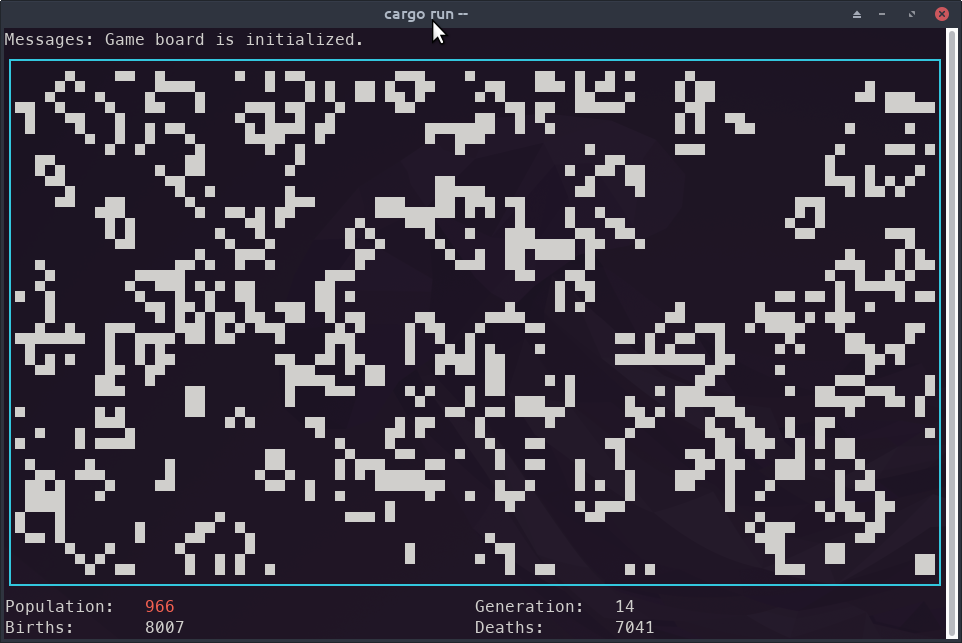

# Game of Life in Rust



A simple Conways Game of Life implementation Written In Rust. It provides a
terminal user interface which should run with a simple `cargo run`.

Note: This project is mostly just for my own personal experimentation and Rust
learnings, and as such isn't particularly efficient. There is a fairly low
upper limit to the iteration frequency (somewhere around 40Hz).

## Prerequisites

The only prerequisite for this project is to have a running Rust environment
(Rust 1.65 or later). Refer to
[Getting Started @ rust-lang.org](https://www.rust-lang.org/learn/get-started)
for setup instructions.

## Building and Running

The project can be build and run as follows:

```shell
git clone https://github.com/karlnicoll/rust-game-of-life.git
cd rust-game-of-life
cargo run
```

Some interesting initial seeds are provided if you want to experiment...

### Pentadecathlon

See: <https://conwaylife.com/wiki/Pentadecathlon>

The Pentadecathlon is a relatively simple oscillator that will create 15
different patterns, then return to it's original form.

To run the Pentadecathlon seed:

```shell
cargo run -- -f data/game_pentadecathlon.txt
```

### Gosper Glider Gun

See: <https://conwaylife.com/wiki/Gosper_glider_gun>

The Gosper Glider Gun is a pattern that emits a
[Glider](https://conwaylife.com/wiki/Glider) after 15 iterations, then another
every subsequent thirty iterations.

To run the seed:

```shell
cargo run -- -f data/game_gun.txt
```

### Other Seeds

The unit tests in
[`game_of_life/src/game/game_board.rs`](game_of_life/src/game/game_board.rs)
includes several more seeds that you could add to files and try, including
still life blocks, oscillators and the basic glider pattern.

## Generating Documentation

For the library code (`tui` and `xy_utils` sub-packages), you can generate some
documentation using `cargo doc`.

## License

This project is licensed under the [MIT license](https://mit-license.org/). For
full terms, refer to [LICENSE](LICENSE). For a TL;DR, see
[here](https://tldrlegal.com/license/mit-license).
